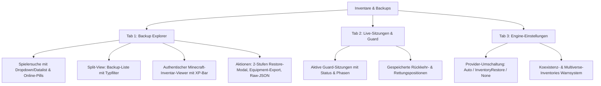

# Dokumentation: Inventar- & Backup-Verwaltung im Web-Interface

Dieses Dokument fasst alle durchgeführten Arbeiten, Architektur-Entscheidungen, UI/UX-Erweiterungen, Fehlerbehebungen und Testergebnisse für die neue dedizierte Inventar- und Backup-Verwaltung zusammen.

---

## 📌 Übersicht & Zielsetzung

Die Inventar-Backup-Verwaltung war ursprünglich tief in den Experteneinstellungen versteckt und bot nur rudimentäre Interaktionsmöglichkeiten. Sie wurde vollständig aus den Experteneinstellungen herausgelöst und als vollwertige, eigenständige Hauptkategorie (`nav.inventories`) im Seitenpanel mit moderner 3-Tab-Architektur und interaktivem Minecraft-Canvas neu aufgebaut.

---

## 🚀 Durchgeführte Änderungen im Detail

### 1. Struktur & Seitenpanel-Integration
- **Eigener Menüpunkt**: Neuer Eintrag **„Inventare & Backups“** (`#section-inventories`) in der Haupt-Sidebar mit Icon `fa-boxes-stacked`.
- **Live-Session Badge**: Dynamische Anzeige der aktuell aktiven Guard-Sitzungen direkt im Sidebar-Menü.
- **Bereinigung**: Vollständige und saubere Entfernung der alten Inventar-Karten aus `#section-expert`.

---

### 2. 3-Tab-Architektur

#### Tab 1: Backup Explorer (Split-View & Minecraft Canvas)
1. **Spielersuche mit Dropdown-Vorschlägen & Schnellwahl**:
   - Automatische Autovervollständigung / Dropdown (`<datalist id="inv-recent-players-list">`), das online Spieler sowie kürzlich gesuchte Spieler anzeigt.
   - Klickbare Online-Player-Pills (`.inv-player-pill`) zur 1-Klick-Auswahl.
   - Unterstützt Spielernamen und UUIDs (inklusive Offline-Spieler).

2. **Filterbare Backup-Liste**:
   - Dynamischer Zähler mit Live-Anzahl (z. B. `Alle (15)`).
   - Filteroptionen:
     - `ALL`: Zeigt alle Backups.
     - `pvp_match`: Filtert auf `pvp-pre-match` und `pvp-post-match`.
     - `event`: Filtert auf `event-pre-join` und `event-post`.
     - `manual`: Filtert auf manuelle und Web-Backups.
   - Bereinigung der Listenelemente: Der redundante "Ansehen"-Knopf wurde entfernt, da ein Klick auf die gesamte Backup-Karte das Inventar automatisch öffnet.

3. **Interaktiver Minecraft-Inventar-Viewer**:
   - **Slot-Layout**:
     - Rüstungsslots: Helm (Slot 3), Brustpanzer (Slot 2), Beinschutz (Slot 1), Stiefel (Slot 0).
     - Nebenhand / Offhand (Slot 40).
     - 27 Hauptinventar-Slots (Bukkit Slots 9–35).
     - 9 Hotbar-Slots (Bukkit Slots 0–8).
   - **Visuelle Highlights**:
     - Echte Textur-Icons aus `items.js`.
     - Stapelmengenanzeige & Verzauberungs-Glanzindikator (`✨`).
     - Realistische XP-Leiste mit prozentualer Füllung und Level-Anzeige.
     - KPI-Karten für Gesamtitemanzahl, belegte Slots und Rüstungspunkte.
   - **Floating Minecraft-Tooltip**:
     - Unterstützt native Minecraft-Farbcodes (`§a`, `§6`, `§l`, `§o`, `§r` etc.).
     - Anzeige von Custom Display Names, Item-Typ, Stapelgröße, Verzauberungen und Lore-Zeilen.

4. **Wiederherstellung (Restore-Modal) & "Givemissing"**:
   - Zweistufige Sicherheitsbestätigung: Erfordert das Eintippen des Spielernamens.
   - Option **„Zuvor Inventar leeren“** (Checkbox):
     - **Aktiviert**: Vollständiger Rollback (Inventar wird zuerst geleert).
     - **Deaktiviert**: Nicht-destruktives Hinzufügen / **Givemissing-Verhalten** (Items aus dem Backup werden dem Spieler zusätzlich ins bestehende Inventar gelegt).

5. **Ausrüstungsset-Export**:
   - Funktion **„Als Ausrüstungsset hinzufügen“**:
     - Wandelt das aktuell ausgewählte Backup in ein vollwertiges Equipment-Set um.
     - Trägt Rüstung, Nebenhand und Inhaltsteile exakt in die Equipment-Konfiguration ein.
     - Registriert die Änderung im Status (`registerChange`), sodass der "Ungespeicherte Änderungen"-Dialog erscheint und das Set gespeichert werden kann.
     - Öffnet direkt die Ausrüstungs-Kategorie im Editor.

6. **Raw-JSON Export**:
   - Kopiert das vollständige Rohdaten-JSON des Backups in die Zwischenablage.

#### Tab 2: Live-Sitzungen & Guard
- Übersicht aller aktuell durch den InventoryGuard geschützten Spieler.
- Anzeige von Kontext (`PVP_MATCH`, `EVENT`), Phasen (`INITIALIZING`, `TELEPORTING`, `ACTIVE`, `RETURNING`, `ORPHANED`) und Startzeitpunkten.
- Anzeige von gesicherten Rückkehr-Standorten (Welt, X, Y, Z).
- 1-Klick-Verlinkung direkt in den Backup Explorer.

#### Tab 3: Einstellungen & Richtlinien
- Schnellumschaltung des Inventory-Providers (`auto`, `inventoryrestore`, `none`) via `POST /api/inventories/provider`.
- Live-Warnungen bei Erkennung von Konflikten mit Multiverse-Inventories oder fehlender Backup-API.

---

## 🛠 Fehlerbehebungen & Optimierungen (Follow-up)

1. **Count-Fehler behoben**:
   - Der Filter-Dropdown zeigte zuvor wörtlich `Alle ({count})` an.
   - Dies wurde behoben: Der String wird in JavaScript dynamisch mit der tatsächlichen Trefferanzahl übersetzt und gerendert.
2. **PvP- & Event-Filter repariert**:
   - Die Filtertypen waren fälschlicherweise auf `pvp_match` und `event` gemappt, während das Backend `pvp-pre-match`, `pvp-post-match`, `event-pre-join` und `event-post` liefert.
   - Die Filterung wurde korrigiert, sodass Pre-Join-Backups nun korrekt gefiltert werden.
3. **Ansehen-Knopf entfernt**:
   - Das redundante Lupen-/Auge-Icon wurde entfernt, da der Klick auf die Karte bereits den Viewer öffnet.
4. **Equipment-Export Speicherung gefixt**:
   - Beim Exportieren eines Backups als Equipment-Set wurde das Set zwar angelegt, aber `registerChange()` wurde nicht getriggert. Dadurch wurde der Speicher-Button nicht aktiviert. Dies wurde behoben.
5. **Spieler-Dropdown hinzugefügt**:
   - Ein `<datalist>` Autocomplete wurde für das Suchfeld implementiert, das Online-Spieler und kürzlich gesuchte Spieler vorschlägt.
6. **Givemissing-Funktionalität verifiziert**:
   - Die Funktionsweise des Schalters "Zuvor Inventar leeren" wurde validiert und dokumentiert (entspricht bei Deaktivierung dem Givemissing-Verhalten).

---

## 🔒 Sicherheit, Rate Limiting & Persistenz

### 1. Globales Rate Limiting für Wiederherstellungen
- **SlidingWindowLimiter**: Auf dem Endpunkt `POST /api/inventories/restore` ist eine globale Bremse von **maximal 10 Wiederherstellungen pro Minute** aktiv.
- **Schutzwirkung**: Verhindert, dass ein kompromittiertes Web-Login im Sekundentakt Backups auf wechselnde Spieler zurückspielt und Items dupliziert.
- **HTTP 429 Status**: Wird das Limit überschritten, antwortet die API mit `429 Too Many Requests` und das Web-Panel zeigt eine entsprechende Warnmeldung.

### 2. Synchron geschriebene Persistenz-Dateien
- `inventory-guard.yml` (`InventoryGuard`): Führt alle offenen Sitzungen atomar und synchron. Beim Serverstart werden unfertige Sitzungen automatisch abgearbeitet.
- `player-return-locations.yml` (`ReturnLocationStore`): Speichert den exakten Rückkehrpunkt vor dem Event-/Arena-Teleport, sodass Spieler nach einem Crash sicher an ihren Ursprungsort zurückgebracht werden.
- `pending-payouts.yml` (`PendingPayoutStore`): Verwaltet ausstehende Wetteinsatz-Gewinne oder Event-Belohnungen, falls ein Spieler vor der Ausschüttung die Verbindung trennt.

### 3. Zugriffsberechtigung
- Der Zugriff auf das Web-Panel und das Erzeugen von Einmal-Tokens via `/eventpvp webtoken` erfordert die Permission `eventpvp.admin.web` (oder `eventpvp.admin`).

---

## 🌍 Lokalisierung (7 Sprachen synchronisiert)

Alle neuen Schlüssel wurden über alle 7 unterstützten Sprachen synchronisiert:
- [src/main/resources/web/lang/de.json](file:///c:/Users/zfzfg/Documents/HammerMegaProjekte/selfmadePlugins/Plugins/Event-PVP-Plugins/Event-PVP-Plugin-1.0.8%20-%20Copy/src/main/resources/web/lang/de.json)
- [src/main/resources/web/lang/en.json](file:///c:/Users/zfzfg/Documents/HammerMegaProjekte/selfmadePlugins/Plugins/Event-PVP-Plugins/Event-PVP-Plugin-1.0.8%20-%20Copy/src/main/resources/web/lang/en.json)
- [src/main/resources/web/lang/es.json](file:///c:/Users/zfzfg/Documents/HammerMegaProjekte/selfmadePlugins/Plugins/Event-PVP-Plugins/Event-PVP-Plugin-1.0.8%20-%20Copy/src/main/resources/web/lang/es.json)
- [src/main/resources/web/lang/fr.json](file:///c:/Users/zfzfg/Documents/HammerMegaProjekte/selfmadePlugins/Plugins/Event-PVP-Plugins/Event-PVP-Plugin-1.0.8%20-%20Copy/src/main/resources/web/lang/fr.json)
- [src/main/resources/web/lang/ja.json](file:///c:/Users/zfzfg/Documents/HammerMegaProjekte/selfmadePlugins/Plugins/Event-PVP-Plugins/Event-PVP-Plugin-1.0.8%20-%20Copy/src/main/resources/web/lang/ja.json)
- [src/main/resources/web/lang/pl.json](file:///c:/Users/zfzfg/Documents/HammerMegaProjekte/selfmadePlugins/Plugins/Event-PVP-Plugins/Event-PVP-Plugin-1.0.8%20-%20Copy/src/main/resources/web/lang/pl.json)
- [src/main/resources/web/lang/ru.json](file:///c:/Users/zfzfg/Documents/HammerMegaProjekte/selfmadePlugins/Plugins/Event-PVP-Plugins/Event-PVP-Plugin-1.0.8%20-%20Copy/src/main/resources/web/lang/ru.json)

---

## 🧪 Validierung & Qualitätssicherung

1. **i18n Audit Suite (`python tools/i18n_audit.py`)**:
   - **Status**: `OVERALL STATUS: SUCCESS (All audits clean)`
   - **Kritische Fehler**: `0`
   - **Warnungen**: `0`
   - **Info-Meldungen**: `0`
   - **Pytest Self-Tests**: `88/88` bestanden.
   - **Logger/Console-Audit**: Sauber.

2. **Maven Build & Tests (`mvn clean test`)**:
   - **Status**: `BUILD SUCCESS`
   - **Unit Tests**: `91/91` bestanden (`0 Errors`, `0 Failures`).
