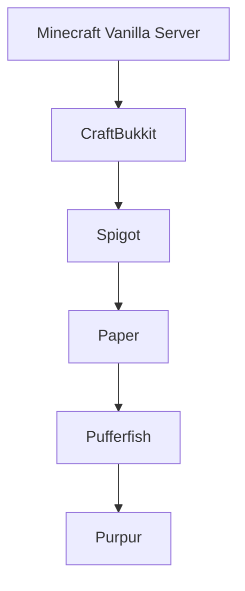

# ⚔️ Vollständiger Vergleich: Purpur vs. Neuestes Spigot (26.2)

Dieses Dokument bietet eine vollständige, technisch detaillierte Gegenüberstellung aller wichtigen Kernpunkte, Features, APIs und Leistungsmerkmale, die auf **Purpur (26.2 / 1.21.x)** einwandfrei funktionieren, auf dem **neuesten Vanilla Spigot (26.2)** jedoch **nicht funktionieren oder komplett fehlen**.

---

## 📑 Inhaltsverzeichnis
1. [Übersicht & Software-Architektur-Hierarchie](#1-übersicht--software-architektur-hierarchie)
2. [Plugin-API & Entwickler-Ebene (Code-Level Inkompatibilitäten)](#2-plugin-api--entwickler-ebene-code-level-inkompatibilitäten)
3. [Performance & Server-Architektur (Engine & Threading)](#3-performance--server-architektur-engine--threading)
4. [Sicherheit, Netzwerk & Proxy-Integration](#4-sicherheit-netzwerk--proxy-integration)
5. [Gameplay, Mechaniken & Konfigurierbarkeit (`purpur.yml`)](#5-gameplay-mechaniken--konfigurierbarkeit-purpuryml)
6. [Direkte Auswirkungen auf das `Event-PVP-Plugin`](#6-direkte-auswirkungen-auf-das-event-pvp-plugin)
7. [Zusammenfassende Vergleichstabelle](#7-zusammenfassende-vergleichstabelle)

---

## 1. 🏗️ Übersicht & Software-Architektur-Hierarchie

Um die Unterschiede zu verstehen, ist die Vererbungshierarchie der Server-Forks entscheidend:

* **Spigot:** Fügt grundlegende Performance-Fixes, `spigot.yml` und die Spigot/BungeeCord-Chat-API hinzu. Hält sich sehr nah an Vanilla.
* **Paper:** Ersetzt die veraltete Server-Architektur durch ein asynchrones Chunk- und Lichtsystem (Spottedleaf), bringt native Kyori Adventure Unterstützung, moderne Plugin-APIs und unzählige Bug-/Exploit-Fixes.
* **Purpur:** Basiert direkt auf Paper/Pufferfish und erweitert den Server um hunderte konfigurierbare Gameplay-Elemente (`purpur.yml`), reitbare Mobs, AFK-Systeme und erweiterte Entity-APIs.

> ⚠️ **Ergebnis:** Alles, was Paper oder Purpur exklusiv bietet, **funktioniert auf reinem Spigot nicht**.

---

## 2. 🧩 Plugin-API & Entwickler-Ebene (Code-Level Inkompatibilitäten)

Wenn ein Plugin für Paper oder Purpur kompiliert wurde, wird es auf Spigot mit hoher Wahrscheinlichkeit zur Laufzeit abstürzen (`ClassNotFoundException` oder `NoSuchMethodError`).

### 2.1 Kyori Adventure Component API (Nativ vs. Fehlt)
* **Auf Purpur / Paper:**
  * Native Integration von Kyori Adventure (`net.kyori.adventure.text.Component`, `MiniMessage`, `Audience`, `Title`, `BossBar`, `Sound`).
  * Direkte Methoden auf `Player`, `CommandSender` und `Server`:
    * `player.sendMessage(Component)`
    * `player.showTitle(Title)`
    * `player.sendActionBar(Component)`
    * `Bukkit.createInventory(owner, size, Component)`
* **Auf Spigot 26.2:**
  * ❌ **Nicht vorhanden.** Adventure-Klassen sind in den Server-Bibliotheken von Spigot nicht enthalten.
  * Spigot nutzt veraltete `§`-Farbcode-Strings oder die BungeeCord Chat Component API (`net.md_5.bungee.api.chat.BaseComponent`).

### 2.2 `ItemMeta` Adventure Overloads
* **Auf Purpur / Paper:**
  * `ItemMeta.displayName(Component)` & `ItemMeta.displayName()`
  * `ItemMeta.lore(List<Component>)` & `ItemMeta.lore()`
  * Ermöglicht saubere MiniMessage/RGB/Hover-Effekte auf Items ohne Legacy-Serialisierung.
* **Auf Spigot 26.2:**
  * ❌ **Fehlt komplett.** Spigot unterstützt nur `ItemMeta.setDisplayName(String)` und `ItemMeta.setLore(List<String>)`.
  * Ein Methodenaufruf wie `meta.lore()` wirft auf Spigot sofort: `NoSuchMethodError: ItemMeta.lore()`.

### 2.3 Paper Plugin-Modell & `getPluginMeta()`
* **Auf Purpur / Paper:**
  * Unterstützung des modernen `paper-plugin.yml`-Formats.
  * Moderne Metadaten-Abfrage über `JavaPlugin.getPluginMeta()` (`PluginMeta`).
  * Lifecycle Event Manager (`LifecycleEventManager`) zur Registrierung von Befehlen, Datapacks und Registry-Einträgen.
  * Bootstrapper API (`PluginBootstrapContext`) und moderne Dependency-Injection (`PluginClasspathBuilder`).
* **Auf Spigot 26.2:**
  * ❌ **Nicht unterstützt.** Spigot kennt nur `plugin.yml` und `getDescription()` (`PluginDescriptionFile`).
  * `getPluginMeta()` wirft `NoSuchMethodError`. `paper-plugin.yml` wird von Spigot ignoriert.

### 2.4 Asynchrone Welt- & Teleport-APIs
* **Auf Purpur / Paper:**
  * `World.getChunkAtAsync(int x, int z)`
  * `World.loadChunkAsync(int x, int z)`
  * `Entity.teleportAsync(Location loc)`
  * Lädt Chunks im Hintergrund; der Server-Tick (TPS) bleibt bei 20.0, selbst wenn Spieler in ungeladene Welten teleportiert werden.
* **Auf Spigot 26.2:**
  * ❌ **Fehlt.** Teleportationen und Chunk-Ladevorgänge sind streng synchron auf dem Haupt-Thread. Bei ungeladenen Chunks friert der Server kurz ein (Lag-Spike).

### 2.5 Erweiterte Event-Pipeline
* **Auf Purpur / Paper vorhanden (auf Spigot fehlend):**
  * `AsyncChatEvent` (modernes, Adventure-basiertes Chat-Event)
  * `PlayerArmSwingEvent`, `PlayerJumpEvent`, `PlayerDeepSleepEvent`, `PlayerElytraBoostEvent`
  * `EntityDamageItemEvent`, `EntityKnockbackByEntityEvent`, `EntityPushedByEntityAttackEvent`
  * `PreCreatureSpawnEvent` (bricht Spawns ab, bevor das Entity-Objekt allokiert wird -> spart massiv RAM)
  * `ServerResourcesReloadedEvent`
* **Auf Spigot:** Nur die alten, synchronen oder String-basierten Events (z. B. `AsyncPlayerChatEvent`).

### 2.6 Purpur-Spezifische Java-APIs
* **Auf Purpur vorhanden:**
  * `org.purpurmc.purpur.entity.RidableEntity` & `ControllableEntity` (dynamisches Modifizieren der Reitbarkeit und WASD-Steuerung).
  * `Player.isAfk()` und `Player.setAfk(boolean)`.
  * `PlayerAFKEvent`.
  * `Server.getPurpurConfig()`.
* **Auf Spigot 26.2:** ❌ Keine dieser Klassen oder Methoden existiert.

---

## 3. ⚡ Performance & Server-Architektur (Engine & Threading)

| Eigenschaft | Purpur 26.2 | Spigot 26.2 | Technischer Hintergrund |
|---|---|---|---|
| **Chunk-System** | 🟢 **Asynchron (Spottedleaf)** | 🔴 **Synchron (Vanilla)** | Purpur generiert, lädt und speichert Chunks auf dedizierten Worker-Threads. Spigot blockiert den Haupt-Tick. |
| **Licht-Berechnung** | 🟢 **Asynchrone Light-Engine** | 🔴 **Synchroner Vanilla-Licht-Tick** | Verhindert Licht-Updates-Lags beim schnellen Fliegen oder Block-Platzieren. |
| **Trichter (Hopper)** | 🟢 **Vollständig optimiert** | 🔴 **Unoptimiert (Vanilla)** | Hoppers auf Purpur cachen Inventare und prüfen Item-Pushes effizient, ohne jeden Tick Chunks zu locken. |
| **Entity Activation Range** | 🟢 **Erweitert & Differenziert** | 🟡 **Rudimentär** | Purpur pausiert inaktive Villager, schlafende Entities und optimiert Kollisionsabfragen (`tick-inactive-villagers`). |
| **Netzwerk & I/O** | 🟢 **Async Compression & Tab-Complete** | 🔴 **Synchron** | Paketkompression und Tab-Vorschläge laufen außerhalb des Main-Ticks. |
| **Integrierter Profiler** | 🟢 **Spark Profiler Nativ (`/spark`)** | 🔴 **Kein nativer Profiler** | Ermöglicht extrem genaue Tick-, CPU- und Speicher-Analysen direkt im Server. |
| **Speicherbereinigung (GC)** | 🟢 **Object-Reuse & Fastutil** | 🔴 **Hohe Garbage-Allokation** | Purpur vermeidet unnötige Java-Objekt-Erzeugungen bei Entity-Ticks. |

---

## 4. 🛡️ Sicherheit, Netzwerk & Proxy-Integration

### 4.1 Modernes Velocity-Proxy-Forwarding
* **Purpur:** Unterstützt natives `velocity.online-mode` mit sicherem Token-Secret (`paper-global.yml`). Verhindert IP-Spoofing und Bypässe ohne Zusatz-Plugins.
* **Spigot:** Unterstützt nativ nur das ungesicherte `bungeecord: true`. Es sind Zusatzplugins (wie *BungeeGuard*) erforderlich, um Angreifer am direkten Port-Beitritt zu hindern.

### 4.2 Eingebautes Anti-Xray (Engine Mode 1 & 2)
* **Purpur:** Besitzt ein hardwarenahes, hocheffizientes Anti-Xray direkt in der Chunk-Paket-Pipeline:
  * *Mode 1:* Versteckt Erze, bis der Spieler einen Nachbarblock aufdeckt.
  * *Mode 2:* Täuscht X-Ray-Clients durch gefälschte Erze im Untergrund.
* **Spigot:** ❌ **Kein Anti-Xray integriert.** Erfordert ressourcenhungrige externe Plugins.

### 4.3 Paket- und Crash-Limiter
* **Purpur:** Nativer Schutz gegen:
  * Ungültige NBT-Payloads in Büchern und Bannern.
  * Recipe-Spam und Tab-Complete Floods.
  * Too-Fast Movement Crash Exploits.
* **Spigot:** Weitgehend ungeschützt gegenüber gezielten Paket-Floods.

---

## 5. 🎮 Gameplay, Mechaniken & Konfigurierbarkeit (`purpur.yml`)

Purpur bietet in der `purpur.yml` hunderte Feineinstellungen für Gameplay und Welten, die in Spigot technisch nicht existent sind:

### 5.1 Reitbare Mobs mit WASD-Lenkung
In Purpur kann nahezu jedes Entity per Rechtsklick geritten und gesteuert werden:
* Enderdrache, Warden, Phantom, Delfin, Eisengolem, Wither, Wächter, Bienen u. v. m.
* Konfigurierbare Flug- und Schwimmgeschwindigkeiten sowie Sitzoeffsets.
* *Spigot:* Unterstützt nur Vanilla-Reittiere (Pferde, Schweine, Strider, Kamele).

### 5.2 Eingebautes AFK-System
* **Purpur:**
  * Automatisches Erkennen von inaktiven Spielern.
  * `/afk` Befehl, `[AFK]` Prefix in der Tabliste, konfigurierbarer Broadcast und Auto-Kick.
* **Spigot:** ❌ Nicht vorhanden (benötigt zusätzliche Plugins).

### 5.3 Nützliche Server-Befehle & Visualisierungen
* `/purpur reload` – Lädt Purpur-Konfigurationen im laufenden Betrieb neu.
* `/tpsbar` & `/rambar` – BossBar-Anzeige für TPS und RAM in Echtzeit.
* `/compass` – BossBar-Kompass für Spieler.
* `/ping`, `/uptime`, `/ram` – Schnelle Diagnose-Befehle.
* *Spigot:* Besitzt keine dieser Befehle oder BossBar-Overlays.

### 5.4 Erweiterte Block- & Item-Mechaniken in Purpur
* **Ender Chest:** Kann per Config auf bis zu **6 Reihen (54 Slots)** erweitert werden.
* **Amboss:** Aufhebung der Reparaturkosten-Grenze (*"Too Expensive!"* / `cumulative-cost: false`), MiniMessage-Farbformatierung bei Umbenennungen.
* **Schilder:** Editierbar per Shift-Rechtsklick; Farb-Unterstützung.
* **Schleifstein (Grindstone):** Gezieltes Entfernen von Lores, Namen oder Flüchen konfigurierbar.
* **Steinmetz (Stonecutter):** Verursacht konfigurierbaren Schaden, wenn Spieler darauf treten.
* **Bienenstöcke:** Maximale Bienen-Anzahl pro Stock konfigurierbar.
* **Spitzhacken mit Seidenberührung:** Können Monster-Spawner abbauen (wenn aktiviert).
* **Kolben (Pistons):** Push-Limit über 12 Blöcke hinaus erweiterbar.
* *Spigot:* Alle diese Mechaniken sind starr an das Vanilla-Verhalten gebunden.

---

## 6. 🎯 Direkte Auswirkungen auf das `Event-PVP-Plugin`

Wenn das aktuelle `Event-PVP-Plugin` auf einem reinen Spigot-Server (wie `C:\Users\zfzfg\Documents\servers\spigot-26.2`) gestartet wird:

| Code-Komponente im Plugin | Auf Purpur 26.2 | Auf Spigot 26.2 | Fehlerursache auf Spigot |
|---|---|---|---|
| **Plugin-Start (`onEnable`)** | 🟢 Startet fehlerfrei | 🔴 **Crash beim Start** | `plugin.getPluginMeta().getVersion()` wirft `NoSuchMethodError`. |
| **Adventure Chat & GUI Messages** | 🟢 100% RGB & Interaktiv | 🔴 **Absturz bei Nachricht** | `player.sendMessage(Component)` wirft `NoSuchMethodError`. |
| **Titel & Actionbars** | 🟢 `player.showTitle(Title)` | 🔴 **Absturz bei Matchstart** | Adventure `Title` API wird von Spigot `Player` nicht implementiert. |
| **Wager- & Trade-GUIs** | 🟢 `meta.lore(List<Component>)` | 🔴 **Absturz beim GUI-Öffnen** | `meta.lore()` existiert in Spigots `ItemMeta` nicht. |
| **Teleportation in Event-Arenen** | 🟢 Asynchron ohne Ruckler | 🟡 Synchron mit Lag | Spigot blockiert den Tick beim Laden der Arena-Chunks. |

---

## 7. 📊 Zusammenfassende Vergleichstabelle

| Feature / Bereich | Purpur 26.2 | Paper 26.2 / 1.21.x | Spigot 26.2 |
|---|:---:|:---:|:---:|
| **Kyori Adventure (Native Components)** | ✅ Ja | ✅ Ja | ❌ Nein |
| **ItemMeta Component-Lore & Name** | ✅ Ja | ✅ Ja | ❌ Nein |
| **`PluginMeta` / `paper-plugin.yml`** | ✅ Ja | ✅ Ja | ❌ Nein |
| **Asynchrone Chunk-Engine (Spottedleaf)** | ✅ Ja | ✅ Ja | ❌ Nein |
| **Asynchrone Teleportation (`teleportAsync`)**| ✅ Ja | ✅ Ja | ❌ Nein |
| **Natives Anti-Xray (Engine Mode 1 & 2)** | ✅ Ja | ✅ Ja | ❌ Nein |
| **Natives Velocity Secret-Forwarding** | ✅ Ja | ✅ Ja | ❌ Nein |
| **Integrierter Spark Profiler** | ✅ Ja | ✅ Ja | ❌ Nein |
| **Reitbare Mobs mit WASD (`purpur.yml`)** | ✅ Ja | ❌ Nein | ❌ Nein |
| **Integriertes AFK-System & Events** | ✅ Ja | ❌ Nein | ❌ Nein |
| **Erweiterte Ender Chests (6 Reihen)** | ✅ Ja | ❌ Nein | ❌ Nein |
| **BossBar TPS / RAM / Compass Overlays** | ✅ Ja | ❌ Nein | ❌ Nein |
| **Amboss Kosten-Uncap & Farb-Namen** | ✅ Ja | ❌ Nein | ❌ Nein |
