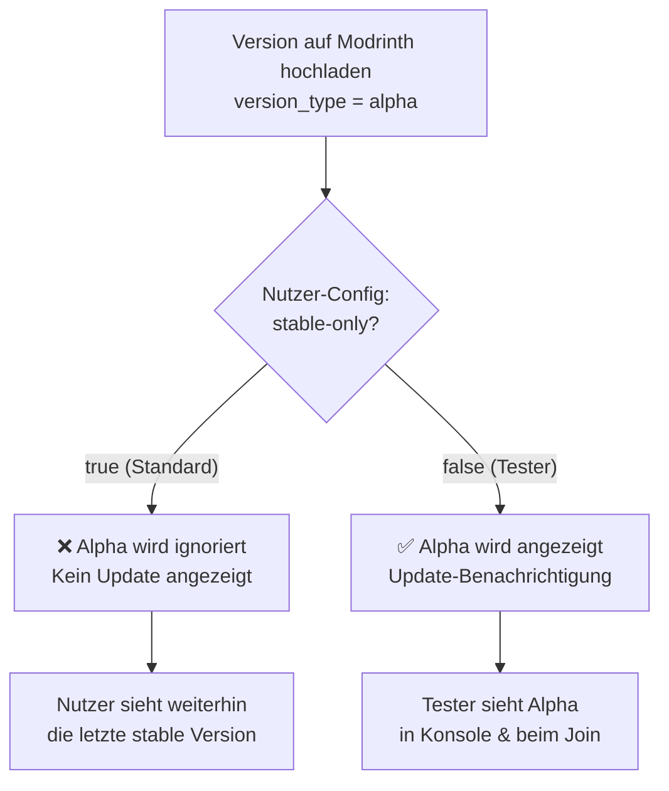

# Alpha-Versionen veröffentlichen ohne Update-Benachrichtigung

## Übersicht: So funktioniert der UpdateChecker

Der [`UpdateChecker`](file:///c:/Users/zfzfg/Documents/HammerMegaProjekte/selfmadePlugins/Plugins/Event-PVP-Plugins/Event-PVP-Plugin-1.0.9-PurpurOptimized/src/main/java/de/zfzfg/eventplugin/util/UpdateChecker.java) holt alle Versionen über die **Modrinth API** (`/v2/project/{id}/version`) und filtert sie anhand des Feldes `version_type`.

### Modrinth kennt drei Versionstypen

| `version_type` | Bedeutung          | Standard-Verhalten im Plugin |
|-----------------|--------------------|------------------------------|
| `release`       | Stabile Version    | ✅ Wird **immer** angezeigt   |
| `beta`          | Beta-Vorabversion  | ❌ Wird **ignoriert** (Standard) |
| `alpha`         | Alpha-Vorabversion | ❌ Wird **ignoriert** (Standard) |

### Der entscheidende Config-Schalter

In der [`config.yml`](file:///c:/Users/zfzfg/Documents/HammerMegaProjekte/selfmadePlugins/Plugins/Event-PVP-Plugins/Event-PVP-Plugin-1.0.9-PurpurOptimized/src/main/resources/config.yml#L163-L174):

```yaml
settings:
  update-check:
    enabled: true
    check-on-startup: true
    notify-admins-on-join: true
    modrinth-project-id: "pqJQdZ6R"
    startup-delay-ticks: 20
    stable-only: true          # <-- DER SCHLÜSSEL
    contact: "https://modrinth.com/plugin/pqJQdZ6R"
```

**`stable-only: true`** (Standard) → Nur Versionen mit `version_type: "release"` werden berücksichtigt.  
**`stable-only: false`** → Auch `beta` und `alpha` Versionen lösen eine Update-Benachrichtigung aus.

### So funktioniert der Filter im Code

```java
// UpdateChecker.java, Zeile 99–109
boolean stableOnly = plugin.getConfigManager() == null
        || plugin.getConfigManager().isUpdateStableOnly();
for (JsonElement element : versions) {
    JsonObject version = element.getAsJsonObject();
    if (stableOnly && version.has("version_type")
            && !"release".equals(version.get("version_type").getAsString())) {
        continue;  // ← Alpha/Beta wird übersprungen
    }
    // ...
}
```

---

## Anleitung: Alpha-Version veröffentlichen

### Schritt 1 — Version benennen

Verwende einen Alpha-Suffix in der Versionsnummer:

| Beispiel              | `isPreRelease()` erkennt | Modrinth `version_type` |
|-----------------------|--------------------------|-------------------------|
| `1.2.0-alpha`         | ✅ `-alpha`               | `alpha`                 |
| `1.2.0-alpha.1`       | ✅ `-alpha`               | `alpha`                 |
| `1.2.0-beta`          | ✅ `-beta`                | `beta`                  |
| `1.2.0-RC1`           | ✅ `-rc`                  | `beta`                  |
| `1.2.0-SNAPSHOT`      | ✅ `-snapshot`            | `alpha`                 |
| `1.2.0-pre1`          | ✅ `-pre`                 | `alpha` oder `beta`     |

> [!IMPORTANT]
> Der Suffix muss mit einem **Bindestrich** (`-`) beginnen, damit `isPreRelease()` und `numericParts()` ihn korrekt erkennen. Ohne Bindestrich (z. B. `1.2.0alpha`) funktioniert die Erkennung **nicht**.

### Schritt 2 — pom.xml anpassen

```xml
<version>1.2.0-alpha.1</version>
```

### Schritt 3 — Auf Modrinth hochladen

Beim Erstellen der Version auf Modrinth den **Version Type** auf **Alpha** (oder **Beta**) setzen:

```
Version Number:  1.2.0-alpha.1
Version Type:    ○ Release   ○ Beta   ● Alpha    ← Alpha auswählen!
```

### Schritt 4 — Fertig!

Da **alle Nutzer standardmäßig `stable-only: true`** in ihrer `config.yml` haben:

- ✅ Die Alpha-Version ist auf Modrinth verfügbar und kann manuell heruntergeladen werden
- ✅ Der UpdateChecker **ignoriert** diese Version bei allen normalen Nutzern
- ✅ Kein Spieler und kein Admin sieht eine Update-Benachrichtigung
- ✅ Der Versionsvergleich erkennt korrekt, dass `1.2.0-alpha.1` **älter** als `1.2.0` ist

---

## Wie Tester die Alpha-Version sehen können

Tester müssen in ihrer `config.yml` nur **einen Wert** ändern:

```yaml
settings:
  update-check:
    stable-only: false    # ← Vorabversionen einschließen
```

Danach zeigt der UpdateChecker auch Alpha- und Beta-Versionen an.

---

## Zusammenfassung: Ablauf



## Checkliste für ein Alpha-Release

- [ ] Version in `pom.xml` auf z. B. `1.2.0-alpha.1` setzen
- [ ] Plugin bauen (`mvn package`)
- [ ] Auf Modrinth hochladen mit **Version Type: Alpha**
- [ ] Tester bitten, `stable-only: false` zu setzen
- [ ] Nach dem Testen: Finale Version als `1.2.0` mit **Version Type: Release** hochladen
